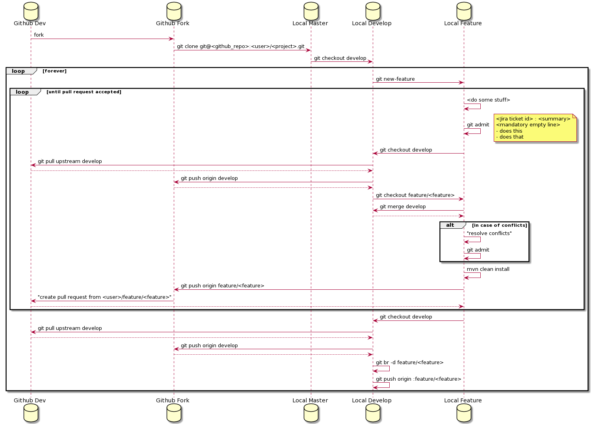

# Git

The goal of this page is to provide information about Git:

* How to install it
* How to configure it
* How to use it
* Which flow are we using?
* FAQ

## Installation

### Linux

```bash
sudo aptitude install git git-flow
```

### Mac

```bash
brew install git git-flow-avh
```

## Configuration

```bash
vim ~/.config/git/config
```

```
[user]
    name        = John Smith
    email       = john.smith@<yourdomain>.com
[alias]
    br          = branch
    sb          = status -sb
    unstage     = reset HEAD --
    admit       = "!git add -A && git commit $@"
    submit      = "!git push origin HEAD:refs/for/$1"
    wtf         = "!git sb && git br && git cherry origin/$1"
    continue    = "!git add -A && git rebase --continue"
    pushall     = "!git push origin --all && git push origin --tags"
    fetch       = fetch --prune 
    pull        = "!git fetch && git pull"
    new-feature = "!git fetch && mvn jgitflow:feature-start -DallowSnapshots=true -DallowUntracked=true"
    new-hotfix  = "!git fetch && mvn jgitflow:hotfix-start -DallowSnapshots=false -DallowUntracked=true -DautoVersionSubmodules=true"
    new-release = "!git fetch && mvn jgitflow:release-start -DallowSnapshots=true -DallowUntracked=true -DautoVersionSubmodules=true"
    finish-feature  = "!git fetch && mvn jgitflow:feature-finish -DallowSnapshots=true -DallowUntracked=true"
    finish-hotfix   = "!git fetch && mvn jgitflow:hotfix-finish -DallowSnapshots=false -DallowUntracked=true"
    finish-release  = "!git fetch && mvn jgitflow:release-finish -DallowSnapshots=false -DallowUntracked=true"
[push]
    default = simple
```

```bash
vim ~/.config/git/ignore
```

```
target/
.idea/
*.iml
```

## Usage

The flow we have to use is the [Github Flow](https://guides.github.com/introduction/flow/) mixed up with 
[Git Flow](http://nvie.com/posts/a-successful-git-branching-model/).

### Startup

First of all: 
* fork the project you want to work on.
* clone your own copy.
* setup upstream repository

```bash
git clone git@<github_repo>:<user>/<project>.git
cd <project>
git remote add upstream git@<github_repo>:dev/<project>.git

```

#### List origin and upstream
```bash
git remote -v

```
You should have something like
```bash
origin	git@<github_repo>:<your_username>/<project>.git (fetch)
origin	git@<github_repo>:<your_username>/<project>.git (push)
upstream	git@<github_repo>:dev/<project>.git (fetch)
upstream	git@<github_repo>:dev/<project>.git (push)

```

### Commit comment

The commit comment should follow some rules. Standard Git rules are:

#### Rules
* The first line is the title in 72 characters.
* Second line should be empty!
* Third line is where the comment begin
    * explain in an informative way what the commit does
    * use '-' to separate different things the commit does 

#### Example

```git
<Jira issue id> <Title>
<mandatory empty line>
- adds this
- removes that
- fixes this
```

### Feature

#### How to start a feature

(1) synchronize develop with upstream:

```bash
git checkout develop
git pull upstream develop # you should not have conflicts
```

(2) create a new feature branch

```bash
git new-feature

# answer the question with the name of the feature, prefer the name of the related issue
```

#### How to synchronize a feature with upstream repository

(1) synchronize develop with upstream:

```bash
git checkout develop
git pull upstream develop # you should not have conflicts
```

(2) synchronize your branch with develop

```bash
git checkout feature/<feature>
git merge develop 
```

(2\`) in case of conflicts:

```bash
# do wile conflicts
#       resolve conflicts if any
        git continue
```

(3) continue to work

#### How to submit a feature

(1) commit your work:

```bash
git admit
```

(2) synchronize develop with upstream:

```bash
git checkout develop
git pull upstream develop # you should not have conflicts
```

(3) synchronize your branch with develop

```bash
git checkout feature/<feature>
git merge develop 
```

(3\`) in case of conflicts:

```bash
# do wile conflicts
#       resolve conflicts if any
        git continue
```

(4) submit your branch:

```bash
git push origin feature/<feature>
```

(5) create a pull request in github from {user}/{project}/feature/{feature} to: dev/{project}/develop

#### Schema



#### How to review

TODO
